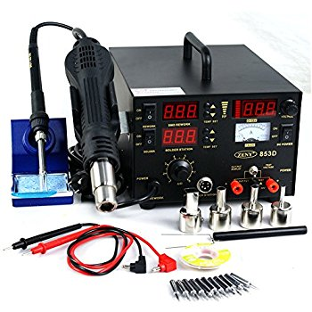

# Electronics

* Hand Tools
  * Diagonal Cutters, Needle Nose Pliers, Tweezers, Dental Pick
  * Wire strippers
  * Breadboard + Cables
  * Multi-Meter
* Outsource PCB's (OSH Park/SeeedStudio/Dirty PCBS/...)
  * KiCAd/Eagle/gEDA/professional
* Soldering
  * Solder, Solder Sucker,
  * Soldering Iron (Weller/Hako/JBC)
  * 3-in-1 (853D) 
  * Magnifying Lens/Microscope
* Scope
  * 100MHz/1Gs, 2 channels
  * Used vs. New
  * Rigol/HP/Tektronix/B&K )
* Cost ~$1000

[(Next)](../hand_tools/README.md) [(Prev)](../getting_started/README.md)
